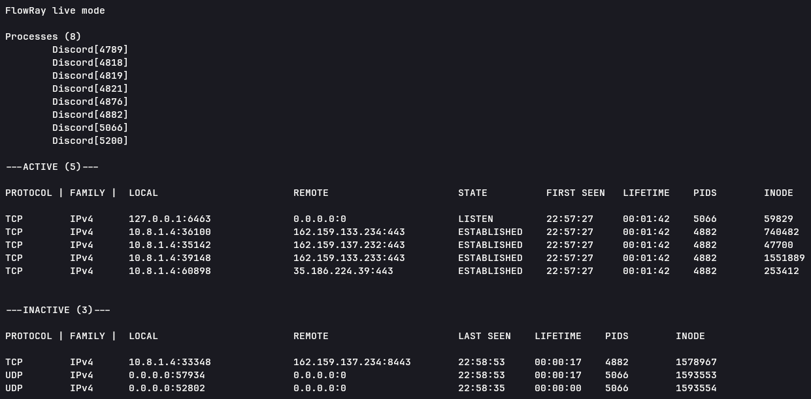

# FlowRay v0.3.0

Linux application network activity analyzer.

FlowRay analyzes Linux network sockets and maps them back to the processes that own them.

## Build

```
git clone https://github.com/Stelour/FlowRay.git

cd FlowRay

cmake -S . -B build

cmake --build build

./build/flowray --help
```

Also download after packets _(example for arch linux)_:
```
sudo pacman -S bpf cmake
```

## Example

Analyze Discord network activity:

```bash
./flowray --name Discord --tree --detail
```

Live monitoring:

```bash
./flowray --name Discord --tree --detail --live
```



## Usage

### Target selection

#### `--pid (-p)`

Analyze sockets belonging to the specified process.

```bash
./flowray --pid 12345
```

#### `--name (-n)`

Analyze processes by their process name.

> Unlike --pid, this option may select multiple processes.

```bash
./flowray --name Discord
```

### Additional flags

#### `--tree (-t)`

Include descendant processes in the analysis.

#### `--detail (-d)`

Show additional socket information, including PID and inode.

#### `--live (-l)`

Continuously monitor socket activity and track connection lifetime.

## FAQ

NETLINK_SOCK_DIAG fails after a system/kernel update

> If the Linux kernel or kernel modules were updated while the system was running, the currently running kernel may no longer match the modules installed on disk. Reboot the system and try FlowRay again.